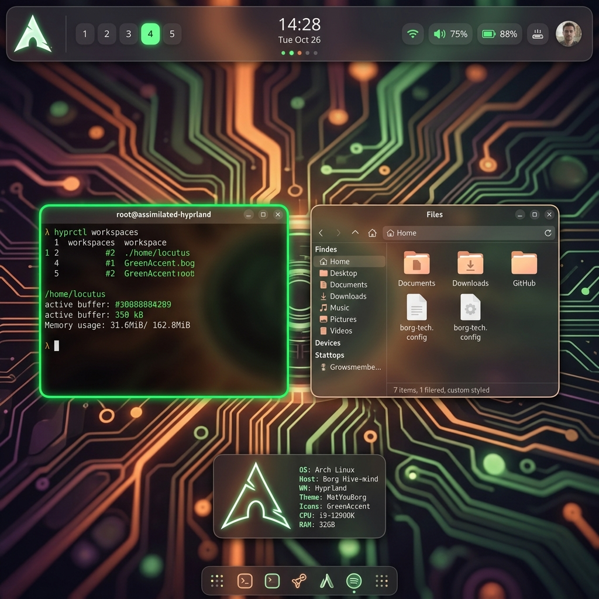

# MaterialBorg Config

# MaterialBorg Profile
Premium, rounded, and personalize-first.

## Overview
This profile is inspired by [hyprland-material-you](https://github.com/hyprland-community/hyprland-material-you) but hardened into a **Borg** aesthetic. It blends Google's Material Design principles with tactical industrial accents.

## Credits & Inspiration
- **Concept**: Material You (Google Design System).
- **Inspiration**: Community configurations focusing on `wallbash` and dynamic theming.
- **Modifications**: Integrated with the Borg dependency suite and optimized for CachyOS performance benchmarks.

## What's Different?
1.  **Aesthetic Focus**: Deep glassmorphism, dynamic accent colors based on wallpaper, and premium typography (Inter/Lexend).
2.  **Borg Extras**: Full integration with the Borg toolset:
    - `Sherlock` (Search)
    - `Kando` (Pie Menus)
    - `HyprWhspr` (Voice Notes)
    - `AI-Quota-Waybar`
3.  **Smooth Transitions**: Balanced animations that emphasize "luxury" movement while maintaining the low-latency core of Hyprland.

## Setup
Run the `install.sh` in this directory. 
> [!TIP]
> This config shines best with colorful high-resolution wallpapers to trigger the Material You color extraction.
